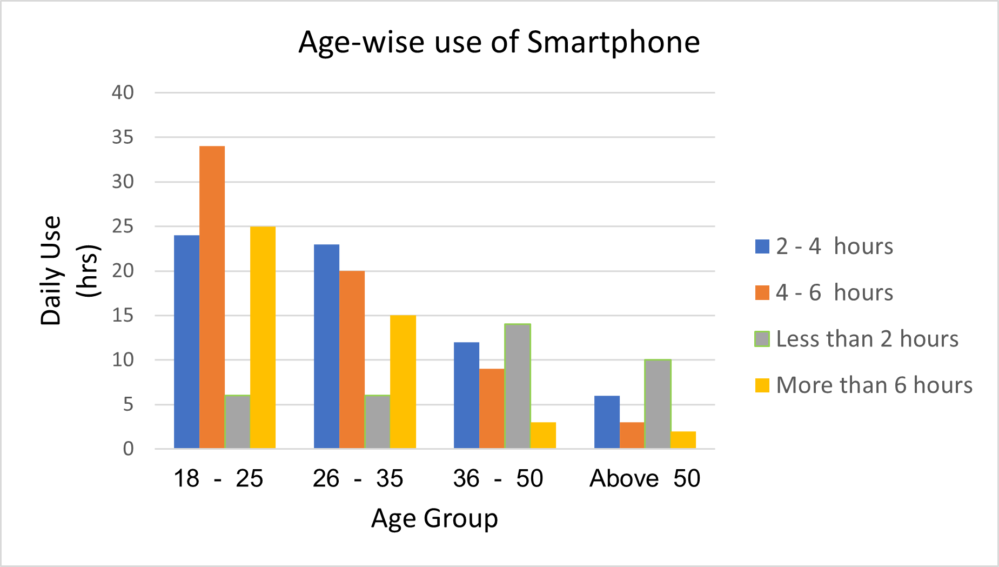
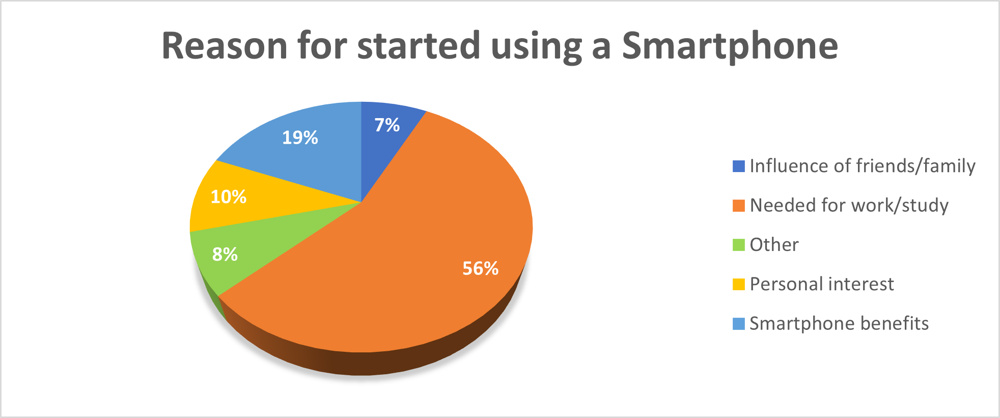
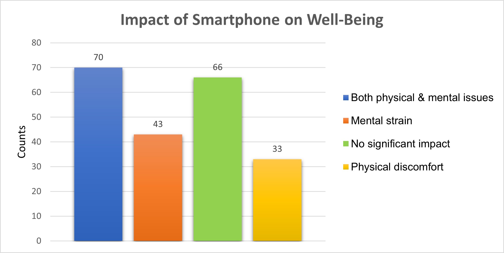

# 📱 Smartphone Trends Project


> A survey-based statistical analysis exploring consumer behavior and smartphone usage trends. This project applies hypothesis testing and visual storytelling to uncover meaningful insights from primary data.

---

## 🧠 Project Overview

This study investigates evolving smartphone usage patterns through direct consumer feedback. Using primary data collected via Google Forms, we conducted statistical tests and visualized key trends to answer questions like:

- What features influence smartphone purchase decisions?
- What tasks do users primarily use their smartphones for?
- Do usage patterns vary by region or occupation?
- Are there any health issues linked to prolonged smartphone usage?
- How does screen time correlate with user satisfaction and productivity?

---

## 📋 Methodology

| Step | Description |
|------|-------------|
| **Data Collection** | Primary data gathered via [Google Forms survey](https://forms.gle/82FkHuSPx5FbxMEY9) |
| **Statistical Analysis** | Hypothesis testing and descriptive statistics performed in RStudio |
| **Visualization** | Charts and graphs created in Microsoft Excel to highlight trends |

---

## 📊 Visualizations

<details>
  <summary>📸 Click to expand charts</summary>
  
Bar chart of age-wise usage of smartphone
<p align="center">
  
</p>
 
Pie chart showing reasons of smartphone adoption
<p align="center">
  
</p>
 
Bar chart showing impact on well-being
<p align="center">
  
</p>
 

</details>

---

## 📁 Project Structure

```bash
smartphone-trends-project/
├── data/                        
├── analysis/                
├── visuals/               
├── docs/                          
└── README.md      


